# VikasDrishti (NEXUS Outcome Intelligence Platform)
### Longitudinal Skilling Outcomes, Impact Measurement & Closed-Loop Policy Learning System

[](https://fastapi.tiangolo.com)
[](https://reactjs.org)
[](https://www.typescriptlang.org/)
[](https://vitejs.dev/)
[](https://tailwindcss.com/)
[](https://sqlite.org)
[](https://scikit-learn.org)

---

## 📌 Executive Summary

**VikasDrishti (NEXUS Outcome Intelligence Platform)** is an enterprise-grade, AI-powered longitudinal skilling outcomes and impact intelligence platform built for national skilling missions (e.g., **Ministry of Skill Development & Entrepreneurship - MSDE**, **NCVET**, **NSDC**, State Skill Development Missions).

Traditional skilling dashboards stop at training completion and short-term placement numbers. **VikasDrishti transforms vocational skilling into a sustainable livelihood lifecycle** by tracking certified trainees at **Day 30, Day 90, Day 180, and Day 365**, validating career outcomes through multi-signal verification, predicting retention/attrition risks using explainable AI, auditing algorithmic fairness across demographic groups, and completing the **closed-loop feedback cycle** where policy interventions improve training curricula for future cohorts.

---

## 🏗️ High-Level System Architecture

```mermaid
flowchart TB
    subgraph UI_Layer["Frontend Presentation Layer (React 18 + TS + Tailwind)"]
        TopNav["TopNav & Role Selector<br/>(Govt / Provider / Trainee / Employer)"]
        FilterBar["Multi-Dimensional Filter Bar<br/>(District, Sector, Provider, Social Category)"]
        Screens["Workspace Screens:
        - HomeScreen (Macro KPIs, Geo-Heatmap, Kaplan-Meier)
        - TraineesScreen (Digital Passport, Wage Curve)
        - TrainingScreen (Course & Provider Benchmarking)
        - JobsScreen (Employer Verification Portal)
        - InsightsScreen (Fairness Audit & Model Drift)
        - ActionsScreen (Closed-Loop Interventions)
        - SettingsScreen (Bilingual EN/HI & Theme)"]
        DemoRunner["9-Step Interactive Live Demo Runner"]
    end

    subgraph API_Layer["Backend Application Layer (FastAPI)"]
        TraineeRouter["/api/trainees"]
        IntelRouter["/api/intelligence"]
        FollowupRouter["/api/followups"]
        VerifyRouter["/api/verification"]
        InterventionRouter["/api/interventions"]
        MLRouter["/api/ml-governance"]
        DemoRouter["/api/demo"]
    end

    subgraph Service_Layer["Core Intelligence & Compute Engines"]
        OutcomeEngine["Outcome Intelligence Engine<br/>(Macro Analytics & Kaplan-Meier Survival)"]
        NLUEngine["Multilingual NLU Engine<br/>(English + Hindi Follow-up Parser)"]
        VerifyEngine["Multi-Signal Verification Engine<br/>(OTP, Employer Portal, Salary Slip)"]
        MLEngine["ML Governance & Prediction Engine<br/>- Placement Classifier (GBM)<br/>- Attrition Risk (RandomForest)<br/>- Fairness & Bias Auditor<br/>- Drift Monitor (KS-Stat)"]
        DataGen["Longitudinal Synthetic Generator<br/>(10,000+ Multi-Signal Trainees)"]
    end

    subgraph Storage_Layer["Data & Persistence Layer (SQLAlchemy + SQLite)"]
        DB[(outcome_platform.db)]
        TraineeTables["Trainees, Batches, Courses, Providers"]
        OutcomeTables["EmploymentRecords, WageRecords, Followups"]
        GovTables["ConsentPolicies, TraineeConsents, Verifications"]
        LoopTables["Recommendations, Interventions, ModelLogs, EventStream"]
    end

    UI_Layer -->|Axios REST / JSON| API_Layer
    API_Layer --> Service_Layer
    Service_Layer --> Storage_Layer
```



---

## 🔑 Key Features & Core Capabilities

### 1. Longitudinal Trainee Lifecycle Tracking (30d - 90d - 180d - 365d)
- Tracks trainees past graduation across multiple milestones.
- Measures **true sustainable livelihood**: wage growth velocity, job retention probability, and attrition reasons (e.g., salary dissatisfaction, location/migration friction, skill mismatch).
- Generates **Kaplan-Meier Survival Curves** showing cohort retention decline over 12 months.

### 2. Multilingual Conversational AI Follow-ups (English & Hindi)
- Natural Language Follow-up Parser supporting conversational text from WhatsApp, SMS, and IVR channels.
- Extracts structured variables from unstructured responses:
  - Employment status (`EMPLOYED`, `SELF_EMPLOYED`, `APPRENTICE`, `UNPLACED`, `HIGHER_ED`)
  - Employer name & designation
  - Real-time monthly wage amounts (e.g., *"18 hazaar salary hai"*, *"20k per month"*)
  - Job satisfaction ratings (1–5) and granular exit reasons.

### 3. Multi-Signal Outcome Verification
- Replaces unverified self-reporting with a weighted **Multi-Signal Verification Confidence Framework**:
  - **Signal 1**: Employer Portal Direct Confirmation (Weight: 35%)
  - **Signal 2**: Employer 1-Click Statutory OTP Confirmation (Weight: 30%)
  - **Signal 3**: Salary Slip Document Upload & Analysis (Weight: 20%)
  - **Signal 4**: Longitudinal Follow-up Consistency Check (Weight: 15%)
- Calculates overall verification confidence scores (e.g., >85% = Verified).

### 4. Dynamic Skill Gap Discovery & Labor Market Alignment
- Triangulates Course Qualification Packs (QPs) against live employer job postings.
- Discovers curriculum deficits in real time (e.g., *"82% of employers require PowerBI & Business Communication for Data Entry roles, but QP only teaches basic spreadsheet entry"*).
- Calculates the **Placement Impact Deficit** for each missing skill.

### 5. Explainable AI, Algorithmic Fairness & Model Governance
- **Placement Probability Predictor**: Gradient Boosting model predicting post-course placement likelihood.
- **Attrition Risk Predictor**: Random Forest model flagging high-risk trainees within the first 90 days.
- **Explainability**: Returns top positive and negative impact factors driving each prediction.
- **Fairness & Demographic Parity Audit**: Computes Disparate Impact Ratios (DIR) across Social Categories (`GEN`, `OBC`, `SC`, `ST`, `EWS`), Gender, and Rural/Urban geographies to guarantee zero bias.
- **Data Drift Monitor**: Tracks Kolmogorov-Smirnov statistic and feature distribution drift.

### 6. Closed-Loop Evidence-Based Policy Interventions
- The system automatically formulates actionable policy recommendations with expected placement lift.
- Policy makers can launch and monitor **Interventions** (e.g., Curriculum Upgrade, Employer Tie-Up, Soft Skills Bootcamp).
- Compares pre-intervention and post-intervention cohorts to quantify the **Impact Delta Percentage** (+24.5% placement lift, +22.2% 6-month retention).

### 7. Interactive 9-Step Live Demo Runner
- Built-in guided simulation executing a full end-to-end policy lifecycle in 9 interactive steps:
  1. Trainee completes training & receives Verified Skill ID.
  2. Trainee reports job via WhatsApp in Hindi (*"Tata Power Renewables mein kaam, 18k salary"*).
  3. Employer verifies outcome via 1-click statutory OTP.
  4. Day 180 checkpoint records wage growth (+19.4%).
  5. Aggregated Kaplan-Meier 12-month retention curve computed.
  6. AI discovers dynamic curriculum skill gap.
  7. Government dashboard flags underperforming course anomaly.
  8. Policy administrator launches targeted intervention.
  9. Subsequent cohort shows measured outcome improvement (+24.5% placement lift), completing the self-improving policy loop.

---

## 💻 Tech Stack & Architecture Details

### Backend Tech Stack
- **Framework**: Python 3.10+ / [FastAPI](https://fastapi.tiangolo.com/) (Asynchronous ASGI)
- **Database / ORM**: [SQLAlchemy 2.0](https://www.sqlalchemy.org/) with SQLite (`outcome_platform.db`)
- **Validation**: [Pydantic v2](https://docs.pydantic.dev/)
- **Machine Learning**: [scikit-learn](https://scikit-learn.org/), NumPy, Pandas
- **NLU / Regex Engine**: Custom rule-based bilingual regex parser with Devanagari script detection
- **Server**: [Uvicorn](https://www.uvicorn.org/)

### Frontend Tech Stack
- **Framework**: [React 18](https://react.dev/) + [TypeScript](https://www.typescriptlang.org/)
- **Build Tool**: [Vite 6](https://vitejs.dev/)
- **Styling**: [Tailwind CSS 3](https://tailwindcss.com/) + Custom Glassmorphic Dark/Light Themes
- **State Management**: [Zustand 5](https://github.com/pmndrs/zustand)
- **Data Visualization**: [Recharts 2.15](https://recharts.org/) (Kaplan-Meier survival curves, bar charts, area graphs, radar charts)
- **Icons**: [Lucide React](https://lucide.dev/)
- **HTTP Client**: [Axios](https://axios-http.com/)

---

## 🗄️ Database Architecture & Data Models

The database contains over **20 interconnected relational tables** supporting the longitudinal skilling lifecycle:

| Table Name | Description | Key Fields |
| :--- | :--- | :--- |
| `users` | Role-based system access | `id`, `email`, `role`, `organization_id` |
| `schemes` | National skill schemes | `id`, `code`, `name`, `budget_crores`, `target_beneficiaries` |
| `programmes` | Specific training programs under schemes | `id`, `scheme_id`, `code`, `name`, `target_sector` |
| `providers` | Training partners & organizations | `id`, `code`, `name`, `category`, `state`, `rating`, `data_quality_score` |
| `training_centres` | Physical training facilities | `id`, `provider_id`, `name`, `state`, `district`, `pincode`, `lat`/`lng` |
| `courses` | NSQF aligned qualification packs | `id`, `qp_code`, `name`, `sector`, `nsqf_level`, `expected_entry_wage` |
| `batches` | Training cohorts | `id`, `provider_id`, `centre_id`, `course_id`, `batch_code`, `start_date`, `status` |
| `skills` | Standardized competency taxonomy | `id`, `name`, `category`, `demand_level` |
| `course_skills` | Skill-to-course curriculum mapping | `id`, `course_id`, `skill_id`, `depth_level` |
| `trainees` | Central trainee entity | `id`, `skill_id`, `full_name`, `gender`, `social_category`, `district`, `current_status` |
| `identities` | Digital ID tokens & hashes | `id`, `trainee_id`, `id_type`, `id_token_hash`, `verification_status` |
| `consent_policies` & `trainee_consents` | DPDP Act compliant consent ledger | `id`, `trainee_id`, `purpose_code`, `status`, `channel`, `granted_at` |
| `attendance` & `assessments` | Course execution & exam scores | `theory_score`, `practical_score`, `total_score`, `biometric_verified` |
| `certifications` | Digital verified certificates | `id`, `trainee_id`, `certificate_number`, `nsqf_level`, `qr_code_hash` |
| `employers` & `job_postings` | Industry partners & hiring demand | `id`, `cin_or_reg`, `company_name`, `sector`, `verification_tier` |
| `employment_records` | Placed jobs and longitudinal roles | `id`, `trainee_id`, `employer_id`, `starting_wage`, `current_wage`, `skill_relevance_score` |
| `wage_records` | Multi-checkpoint wage history | `id`, `trainee_id`, `checkpoint_day` (0, 30, 90, 180, 365), `monthly_wage` |
| `followups` & `followup_responses` | Conversational survey records | `checkpoint`, `channel_used`, `transcript_raw`, `extracted_wage`, `nlu_confidence` |
| `verification_records` | Multi-signal proof logs | `id`, `employment_id`, `signal_type`, `signal_weight`, `is_positive` |
| `skill_gaps` | Machine-detected skill gaps | `course_id`, `skill_name`, `demand_volume`, `curriculum_coverage_score` |
| `recommendations` & `interventions` | Closed-loop policy management | `code`, `title`, `baseline_placement_rate`, `post_placement_rate`, `impact_delta_percentage` |
| `model_predictions` & `model_metrics` | ML governance, telemetry & fairness | `model_type`, `accuracy`, `auc_roc`, `disparate_impact_ratio`, `drift_score` |
| `event_stream` & `audit_logs` | Immutable audit trail of platform events | `event_type`, `entity_id`, `actor_id`, `payload`, `timestamp` |

---

## 📂 Repository Structure

```
S135/
├── backend/
│   ├── app/
│   │   ├── api/
│   │   │   ├── demo.py            # 9-Scenario interactive demo endpoints
│   │   │   ├── followups.py       # Conversational follow-up NLU APIs
│   │   │   ├── intelligence.py    # Macro KPIs, District Geo-Heatmap, Benchmarks
│   │   │   ├── interventions.py   # Policy recommendations & closed-loop tracker
│   │   │   ├── ml_governance.py   # ML inference, fairness audit & drift monitor
│   │   │   ├── trainees.py        # Trainee queries, profiles & digital passports
│   │   │   └── verification.py    # Multi-signal verification queue & confirm APIs
│   │   ├── models/
│   │   │   ├── database.py        # SQLAlchemy engine & session factory
│   │   │   ├── pydantic_models.py # Request/Response schemas
│   │   │   └── schema.py          # Complete 20+ table relational data models
│   │   ├── services/
│   │   │   ├── data_generator.py  # 10,000+ realistic synthetic trainee seeder
│   │   │   ├── intelligence_engine.py # Core analytics & Kaplan-Meier logic
│   │   │   ├── ml_service.py      # Scikit-learn models, fairness & drift auditor
│   │   │   └── nlu_followup.py    # Bilingual (EN/HI) conversational NLU parser
│   │   └── main.py                # FastAPI app initialization, CORS & lifespan
│   └── tests/                     # Test suites
├── frontend/
│   ├── src/
│   │   ├── components/
│   │   │   ├── screens/
│   │   │   │   ├── ActionsScreen.tsx     # Closed-loop policy interventions
│   │   │   │   ├── HomeScreen.tsx        # National executive overview & KPIs
│   │   │   │   ├── InsightsScreen.tsx    # ML governance & fairness audits
│   │   │   │   ├── JobsScreen.tsx        # Employer verification & hiring portal
│   │   │   │   ├── SettingsScreen.tsx    # System config & multilingual controls
│   │   │   │   ├── TraineesScreen.tsx    # Trainee registry & digital passport
│   │   │   │   └── TrainingScreen.tsx    # Course & training provider benchmarks
│   │   │   ├── shell/
│   │   │   │   ├── FilterBar.tsx         # Global multidimensional filter bar
│   │   │   │   ├── Sidebar.tsx           # Workspace navigation sidebar
│   │   │   │   └── TopNav.tsx            # Header, role switcher & demo button
│   │   │   └── InteractiveDemoRunner.tsx # 9-step guided live interactive walkthrough
│   │   ├── services/
│   │   │   └── api.ts                    # Typed Axios client for all backend endpoints
│   │   ├── store/
│   │   │   └── useFilterStore.ts         # Global Zustand state (role, filters, lang, theme)
│   │   ├── types/                        # TypeScript domain interfaces
│   │   ├── App.tsx                       # Main application shell
│   │   └── main.tsx                      # React root entry point
│   ├── package.json
│   ├── tailwind.config.js
│   ├── tsconfig.json
│   └── vite.config.ts
├── start_backend.py                      # One-click backend startup script
├── outcome_platform.db                   # Pre-seeded SQLite database
├── overview_widget.html                  # Standalone embeddable executive widget
├── trainee_journey_widget.html           # Standalone embeddable trainee journey widget
└── README.md                             # Project architecture & documentation
```

---

## 🚀 Getting Started & Execution Guide

### Prerequisites
- **Python 3.10+** (with `pip`)
- **Node.js 18+** (with `npm`)

---

### Step 1: Start the Backend Server

Open a terminal in the project root directory:

```bash
# 1. (Optional) Activate your virtual environment
# python -m venv venv
# venv\Scripts\activate  (Windows)

# 2. Install backend dependencies if not already installed
pip install fastapi uvicorn sqlalchemy pydantic scikit-learn numpy pandas

# 3. Launch the backend server
python start_backend.py
```

- **Backend API**: `http://127.0.0.1:8000`
- **Interactive OpenAPI Documentation (Swagger UI)**: `http://127.0.0.1:8000/docs`
- **Alternative ReDoc**: `http://127.0.0.1:8000/redoc`

*Note: On first startup, the application creates all database tables and seeds 10,000 longitudinal trainee records automatically if the database is empty.*

---

### Step 2: Start the Frontend Application

Open a second terminal in the `frontend` directory:

```bash
# 1. Navigate to the frontend directory
cd frontend

# 2. Install frontend dependencies
npm install

# 3. Start the Vite development server
npm run dev
```

- **Frontend Application**: `http://localhost:5173`

---

## 🌐 API Reference Overview

| Router | Method | Endpoint | Description |
| :--- | :--- | :--- | :--- |
| **Intelligence** | `GET` | `/api/intelligence/macro-overview` | National Macro KPIs (enrolled, certified, placement rate, wage growth) |
| **Intelligence** | `GET` | `/api/intelligence/district-map` | District-level outcome heatmaps & coverage |
| **Intelligence** | `GET` | `/api/intelligence/course-benchmarks` | Course certification vs placement vs wage comparisons |
| **Intelligence** | `GET` | `/api/intelligence/provider-benchmarks`| Training provider ratings and performance tiers |
| **Intelligence** | `GET` | `/api/intelligence/skill-supply-demand`| Dynamic skill gap deficit ranking |
| **Intelligence** | `GET` | `/api/intelligence/retention-attrition`| Kaplan-Meier survival points & reason breakdown |
| **Trainees** | `GET` | `/api/trainees` | Paginated trainee search with multi-filters |
| **Trainees** | `GET` | `/api/trainees/{id_or_skill_id}` | Full Trainee Passport (identities, wage curve, ML risk) |
| **Follow-ups** | `POST` | `/api/followups/process-conversation` | Bilingual NLU parser for WhatsApp/SMS responses |
| **Verification**| `GET` | `/api/verification/pending-queue` | Pending employer outcome verifications |
| **Verification**| `POST` | `/api/verification/verify-signal` | Submit verification signal (OTP / Portal / Slip) |
| **Interventions**| `GET` | `/api/interventions/recommendations` | AI-generated policy recommendations |
| **Interventions**| `POST` | `/api/interventions/create` | Launch a new closed-loop policy intervention |
| **Interventions**| `GET` | `/api/interventions/active-tracker` | Pre vs Post intervention impact delta scorecard |
| **ML Governance**| `GET` | `/api/ml-governance/predict-placement/{id}` | Explainable placement prediction with feature weights |
| **ML Governance**| `GET` | `/api/ml-governance/fairness-audit` | Disparate impact ratio across demographic subgroups |
| **Demo Runner** | `GET` | `/api/demo/scenarios` | List 9 life-cycle demo stages |
| **Demo Runner** | `GET` | `/api/demo/scenario/{scenario_id}` | Dynamic data payload for live demo steps |

---

## 🎯 Verification & Testing

To test the complete system flow:
1. Open `http://localhost:5173` in your browser.
2. Click **"🚀 Live 5-Min Guided Demo"** on the top navigation bar.
3. Step through all 9 interactive scenarios to experience:
   - Trainee certificate issuance
   - WhatsApp Hindi follow-up response parsing
   - One-click employer verification
   - 6-month wage progression milestone
   - Kaplan-Meier longitudinal retention curve
   - Machine learning skill gap discovery
   - Weak course anomaly flagging
   - Launching a closed-loop curriculum intervention
   - Verification of post-intervention cohort outcome improvement (+24.5% placement lift).

---

## 🛡️ Compliance & Governance Standards
- **DPDP Act (Digital Personal Data Protection Act) Compliant**: Explicit purpose-bound consent ledger with revocability and channel attribution.
- **National Credit Framework (NCrF) & NSQF Aligned**: Standardized qualification pack qualification codes.
- **Algorithmic Fairness (IEEE 7000 / NITI Aayog AI Principles)**: Zero demographic disparity tolerance in placement predictions.
